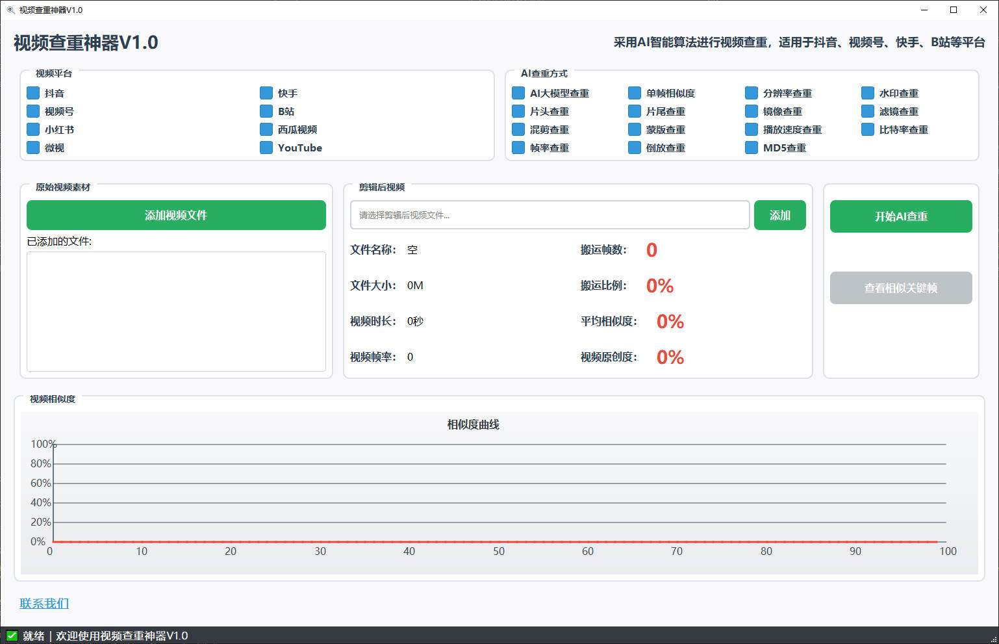
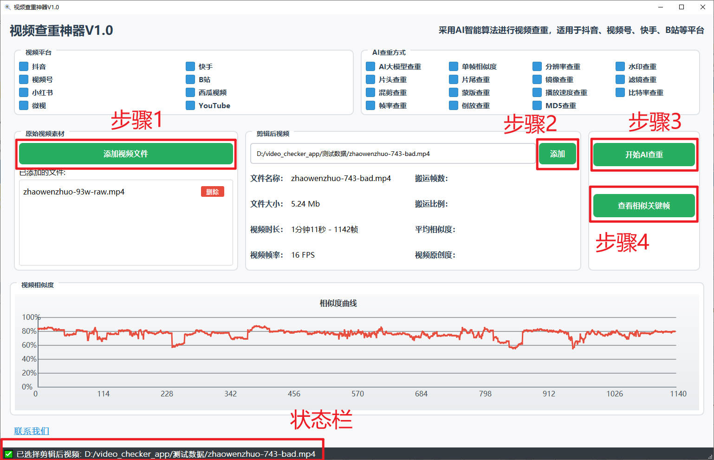
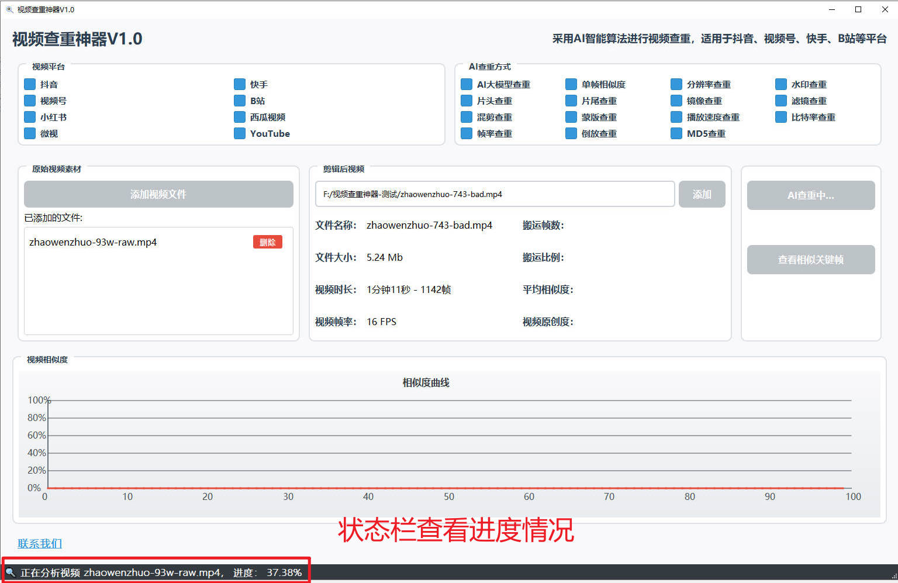
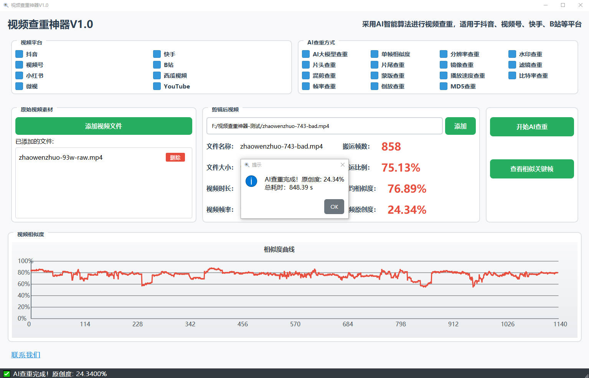
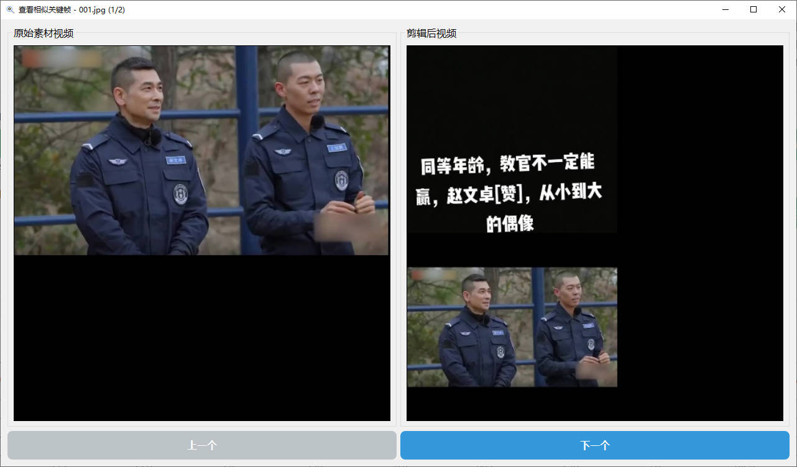
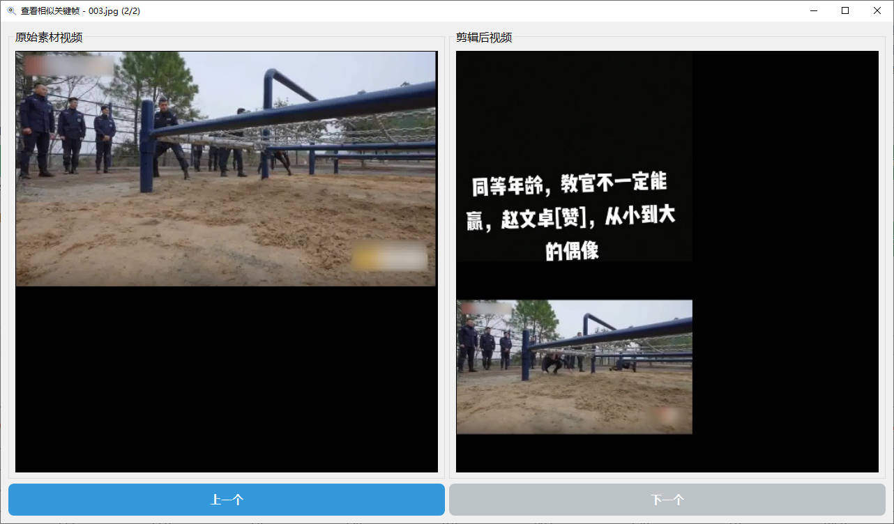
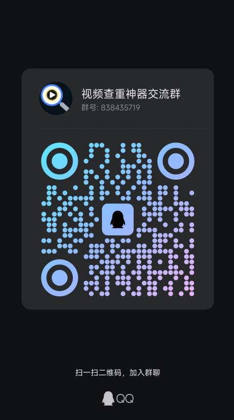

## 软件介绍

视频查重神器是一款用于检测视频原创度的软件，帮助用户提升视频原创度。适用于抖音、视频号、快手、B站等平台。

该软件使用AI智能算法，先分析视频内容特征，再使用云端AI大模型进行判断，能够准确地评估出视频的原创度。

## 下载地址

链接: https://pan.baidu.com/s/1DSmsI3l0i9-ilsqgMsxC5w?pwd=6666 

提取码: 6666

## 使用说明

### 开始界面

###  操作步骤

### 查看进度

### 查看结果

#### 原创作品

#### 非原创作品

##### 查看相似关键帧

## 联系方式

**开发者：** zhongqianli
**QQ:** 596930121
**QQ群:** 视频查重神器交流群 838435719

